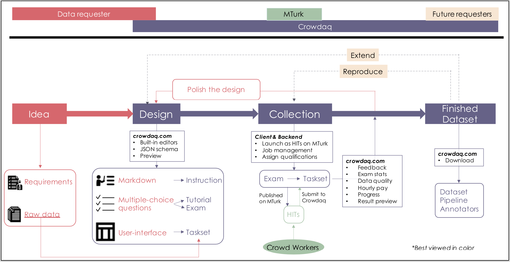
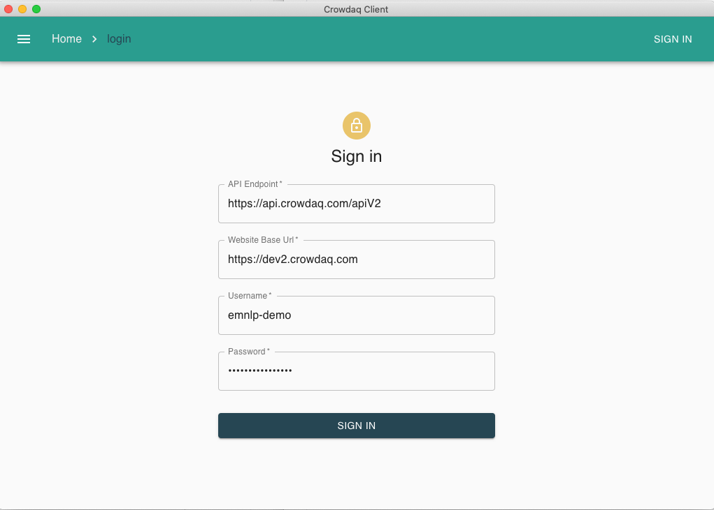

Get Started
------------
## Account

### Sign-up 
As of Nov 2020, we are only taking sign-up requests through emails. If you don't already have an account to login, please send an email to Qiang Ning at \[first name initial\]\[last name\]@amazon.com.

### Login
If you have got your login credentials, you can go to https://www.crowdaq.com and look for the login portal on the top right.

## Data Collection Workflow

Given some raw data, a typical workflow to collect human annotations via Crowdaq and MTurk is as follows.
- Write instructions [[example](https://dev2.crowdaq.com/w/instruction/emnlp-demo/QuantityLabeling)]
- Design tutorial and exam questions \[[tutorial example](https://dev2.crowdaq.com/w/tutorial/emnlp-demo/QuantityLabeling)\] \[[exam example](https://dev2.crowdaq.com/w/exam/emnlp-demo/QuantityLabeling)\]
- Design annotation user-interface (UI) [[example](https://dev2.crowdaq.com/w/task/emnlp-demo/Sentiment/1605588650506)]
- Launch your task set onto MTurk
- Check annotation quality and if necessary, revise your instructions, tutorials, exams, and/or UI
- Download your dataset and all associated Crowdaq files that can be shared with others (e.g., instructions, tutorials, exams, and UI)

If you are not clear about what we mean by "instructions", "tutorial", "exam", or "task set", please check [here](./terminology.md).

This workflow is also shown below (we have color-coded the figure to show the responsibilities of the data requester, Crowdaq, MTurk, and future requesters who want to reproduce or extend this dataset):

With this workflow above, you may wonder about the relation between Crowdaq and Amazon Mechanical Turk (MTurk):
- MTurk is a platform where crowd workers see a list of annotation jobs each with a certain price set by the requester. Workers will decide whether to take your jobs or not, based on your price, total number of jobs, and past reputation on MTurk.
- Crowdaq uses MTurk as a crowd worker management system.
- Crowdaq hosts your instructions, tutorials, exams, and task sets. What Crowdaq can do is to publish your annotation jobs to MTurk as `ExternalQuestion`s. From MTurk's point of view, your exams and task sets are samely just "annotation jobs" (in MTurk's term, they're HITs).

## Design
Here let's walk through a simple example.

| Component | Example file | How to add it to your Crowdaq account | Visualization |
|:----------|:----------|:---------|:--------------|
|Instruction|[example instruction](./examples/example_instruction.md)|Go to `Instruction` on Crowdaq, click `+ADD`, paste the file content and click `SAVE`.|[preview](https://dev2.crowdaq.com/w/instruction/emnlp-demo/example_instruction)|
|Tutorial|[example tutorial](./examples/example_tutorial.json)|Go to `Tutorials` on Crowdaq, click `+ADD`, paste the file content and click `SAVE`.|[preview](https://dev2.crowdaq.com/w/tutorial/emnlp-demo/QuantityLabeling)|
|Exam|[example exam](./examples/example_exam.json)|Go to `Exams` on Crowdaq, click `+ADD`, type "Exam ID" as the name of your exam, leave other fields unchanged for now. Go to edit this exam, click `Upload Exam Questions`, upload this `example_exam.json` file, in your `Questions` tab you should now see questions successfully uploaded.|[preview](https://dev2.crowdaq.com/w/exam/emnlp-demo/QuantityLabeling)|
|Task set|[Task json in a zip file](./examples/tasks-sharable.zip)|Go to `Annotation Tasks` on Crowdaq, click `+ADD`, type in your `Taskset ID`, and then within this taskset, click `UPLOAD TASKS`, upload the zip file, and you should now see several tasks added successfully.|[preview](https://dev2.crowdaq.com/w/task/emnlp-demo/Sentiment/1605588650506)|

Note you can always preview your files in your own account on Crowdaq. The preview links above are separate files that we have created and you can double check if you have done it correctly.

The source files for instructions, tutorials, and exams are self-explanatory and the syntaxes are also easy to learn. For more information about how to design your own UI, please refer to [here](./ui.md).

## Launch
It is very easy to launch an exam or a task set to MTurk. Crowdaq comes with a [client](https://github.com/Crowdaq/crowdaq-desktop-client) package that one can install and run from your local computer. See below for how to login on this client software.

Go to your exams or task sets, and use the "PUBLISH TO MTURK" tab there. Remember to set up your AWS credentials associated with your MTurk account ([AWS instruction](https://docs.aws.amazon.com/cli/latest/userguide/cli-configure-files.html)).

For more details on how to launch HITs to MTurk, please refer to [here](./launch.md).

## Monitor
Please explore the Crowdaq website to monitor your exams and task sets. In short, you will be able to see:

**For your exams**
- How many people have worked on your exam
- Each individual submission to your exam (so you can check those mistakes a specific worker has made)
- Grade distribution of workers on your exam and each individual questions

**For your task sets**
- How many people have worked on your taskset and each of their submissions
- Progress: how many tasks are finished
- Gini index: showing the diversity of your dataset (check Appendix D of this [paper](https://arxiv.org/pdf/2005.00242.pdf))
- Statistics such as the average time a specific task costs workers and the average time a specific worker spends on tasks. This is very important to set up your price for each HIT.
- Inter-annotator Agreement: based on the WAWA metric (check Appendix E of this [paper](https://arxiv.org/pdf/2005.00242.pdf))

## Release
Once your dataset annotation is finished, you may want to
- Publish your dataset
- Publish the Crowdaq pipeline that you have used to collect these data
Please refer to [here](./release.md) for how to do the above.

